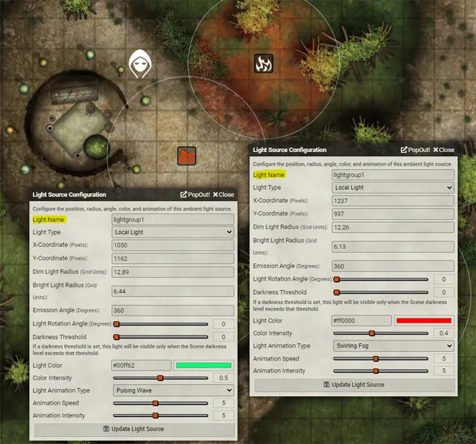

   

# LightSwitch
This module allows players to trigger a macro that turns on and off lights (through the GM).

## How to use
###### **NOTE:**  A GM and player are required for this module to work.

 1. Open up any light configuration panel and set the name of the light. (Multiple lights can share a name and be triggered as a group.) When you're done, click Update Light Source.

 2. Toggle the light(s) on or off in any combination by right clicking a light.
 3. Create a macro with the type *script*, with the following contents, replacing *lightgroup1* with the name of your light(s): `game.LightSwitch.flipTheSwitch("lightgroup1")` 
 4. Use whatever module you wish to trigger the macro.  I recommend the module [Trigger Happy](https://foundryvtt.com/packages/trigger-happy/)
 5. Repeat the process for any other lights

When the macro is triggered, all lights matching the name you set in the macro will be toggled. If there are multiple lights, this could mean that some switch on, while others switch off.